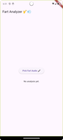
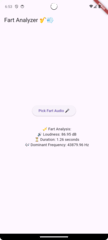

# 💨 OnlyFarts – The Scientific Fart Analyzer

Because analysing farts is rocket science 🚀 🚀 🚀

## 🎺 What is OnlyFarts?

Ever wondered how loud your farts are? Do you think your farts have what it take to challenge the world?

OnlyFarts uses Flutter + Rust to analyze and break down your toots into quantifiable data.

## 🛠 Tech Behind the Toots

* 💙 Built with Flutter for smooth UI
* 🦀 Powered by Rust for high-performance fart analysis
* 🔗 Uses [Flutter Rust Bridge](https://cjycode.com/flutter_rust_bridge/) to seamlessly connect Dart → Rust
* ⚗️ Uses RMS (Root Mean Square) to calculate loudness and FFT (Fast Fourier Transform) to find the frequency

## 📸 Preview




## 🚀 Getting Started

### 1️⃣ Install Requirements
Make sure you have Rust (1.85+) and Flutter (3.27+) installed

```
flutter --version
rustc --version
```


### 2️⃣ Download dependencies

Run this command to get all the necessary packages:

```
flutter pub get
```

### 3️⃣ Run the App

Run an emulator or connect your physical devide and launch

```
flutter run
```

### 💥 If something breaks (like your last fart), you might need to recompile the Rust code

Install Flutter Rust Bridge

```
cargo install flutter_rust_bridge_codegen
```

Regenerate the Rust binding

```
flutter_rust_bridge_codegen generate
```